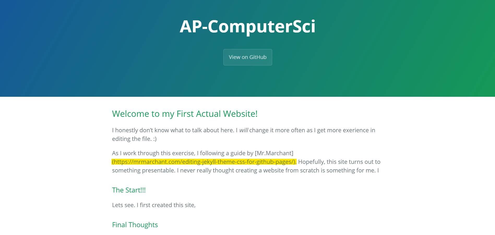
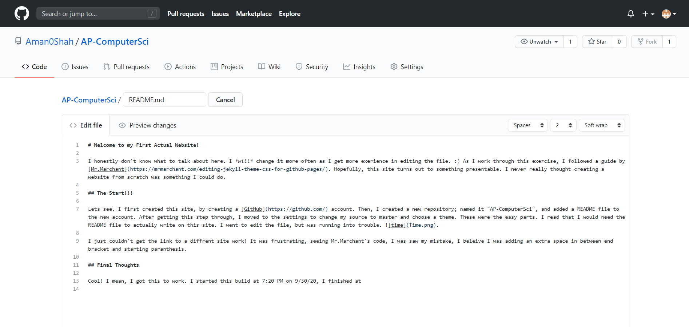

# Welcome to my First Actual Website!

I honestly don't know what to talk about here. I *will* change it more often as I get more exerience in editing the file. :) As I work through this exercise, I followed a guide by [Mr.Marchant](https://mrmarchant.com/editing-jekyll-theme-css-for-github-pages/). Hopefully, this site turns out to something presentable. I never really thought creating a website from scratch was something I could do.  It seemed hard, but along the way, I was able to help some friends set up their website.  

## The Start!!!

Lets see. I first created this site, by creating a [GitHub](https://github.com/) account. Then, I created a new repository; named it "AP-ComputerSci", and added a README file to the new account. After getting this step through, I moved to the settings to change my source to master and choose a theme. This was easy. I read that I would need the README file to actually write on this site. I went to edit the file, but was running into trouble. . 

I just couldn't get the link to a diffrent site work! It was frustrating, seeing Mr.Marchant's code, I was saw my mistake, I beleive I was adding an extra space in between end bracket and starting paranthesis. It was a light mistake but once I fixed the spacing issue, and **WOW** it worked! I got on my way adding more information to the website, and it wasn't long until I started facing a new problem. I didn't understand how to insert a picture into my website. 

I was desperate I asked Mr.Marchant before, I frantically watched a few youtube videos but soon I released that the (src) is case sensative and must not have any space in its name to work properly. OK! Sure, I guess I am done right? Ya. I beleive so. 

## Final Thoughts

Cool! I mean, I got this to work. I started this build at 7:20 PM on 9/30/20, I finished at 1:20 AM on 10/10/20! I feel this is some quality work I have done here. I like it! 👍 Until my next site, hopefully it will not be that far off from today. 
